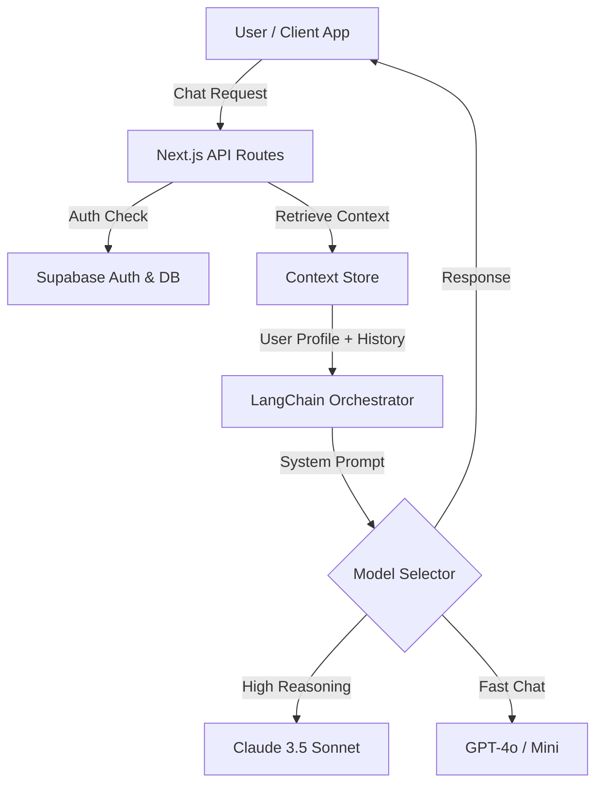

# Huggys: AI Mental Health Companion

Huggys is an AI-powered companionship application designed to bridge the gap between professional therapy sessions. By integrating psychological assessment data with Large Language Models (LLMs), Huggys provides personalized, context-aware emotional support available 24/7.


*(Note: Replace the link above with a real screenshot of your app interface)*

## 🚀 Key Features

*   **Context-Aware Conversations:** Unlike generic chatbots, Huggys injects user psychological profiles (e.g., MBTI, recent mood logs) into the LLM context window to provide tailored advice.
*   **Psych-to-Context Mapping:** A proprietary logic flow that translates clinical assessment scores into natural language system prompts.
*   **Multi-LLM Support:** dynamically switches between OpenAI, Claude, and Gemini models based on query complexity and cost optimization.
*   **Cross-Platform:** Available on iOS (React Native) and Web (Next.js).

## 🛠 Tech Stack

*   **Frontend:** Next.js (Web), React Native (Mobile)
*   **Backend:** Node.js, Supabase (PostgreSQL, Auth)
*   **AI/LLM:** LangChain, OpenAI API, Anthropic Claude API, Google Gemini
*   **Infrastructure:** Vercel, AWS

## 🏗 Architecture



## 🔧 Setup & Installation

1.  Clone the repo
    ```bash
    git clone https://github.com/lucaslv/huggys-chet.git
    ```
2.  Install dependencies
    ```bash
    npm install
    ```
3.  Set up environment variables
    Create a `.env.local` file with:
    ```
    NEXT_PUBLIC_SUPABASE_URL=your_url
    NEXT_PUBLIC_SUPABASE_ANON_KEY=your_key
    OPENAI_API_KEY=your_key
    ```
4.  Run development server
    ```bash
    npm run dev
    ```

## 📈 Impact
*   Designed to serve users during the critical "therapy gap" periods.
*   Achieved 99.9% uptime with automated CI/CD pipelines.

---
*Created by [Lucas Lyu](https://github.com/lucaslv)*
